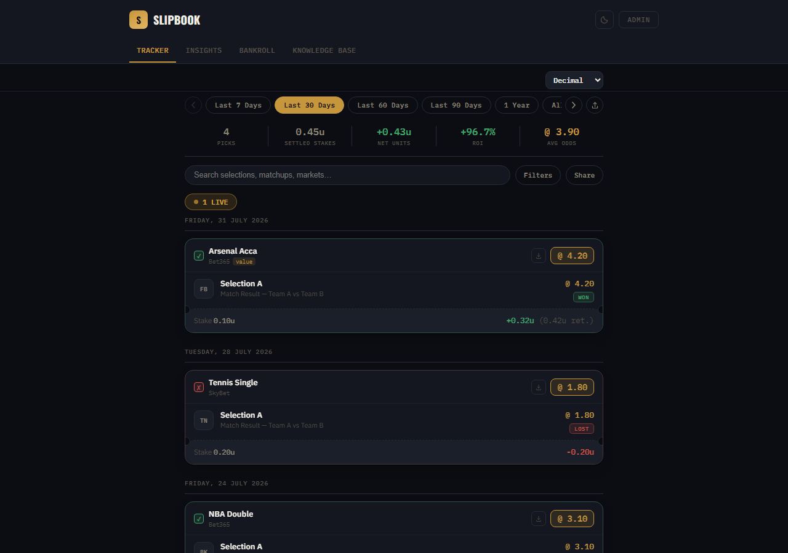
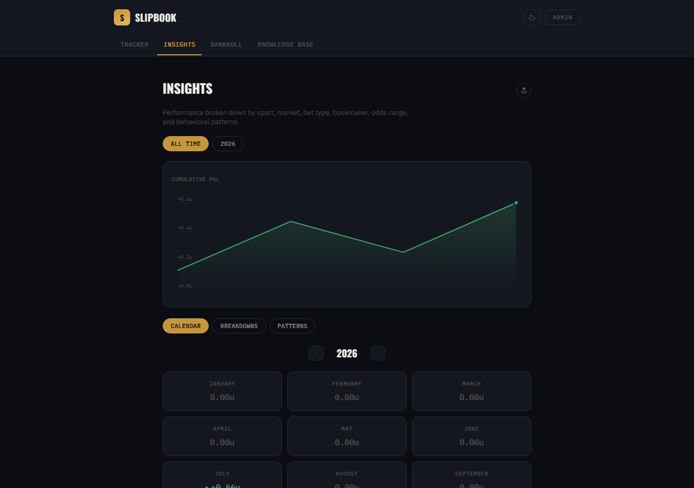
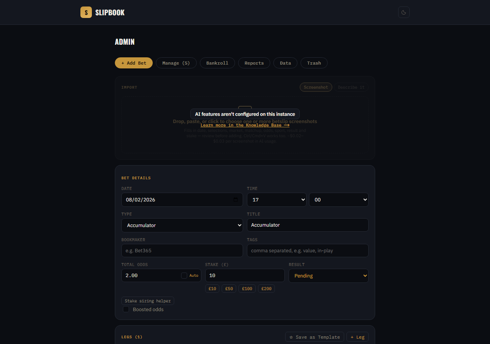

# Slipbook — Self-Hosted Betting Tracker

A single-user betting tracker built with Next.js. Log singles, accumulators, bet builders and each-ways, track results, and see your calendar/stats view — with a simple PIN-gated admin area for adding and editing bets.

This repo is set up so you can fork/clone it and have your own instance running in a few minutes, with your own branding, your own admin PIN, and your own data store.





## Contents

- [Features](#features)
- [Tech stack](#tech-stack)
- [Getting started](#getting-started)
  - [1. Clone and install](#1-clone-and-install)
  - [2. Configure your environment](#2-configure-your-environment)
  - [3. Run it](#3-run-it)
- [AI features (optional)](#ai-features-optional)
- [Making it your own](#making-it-your-own)
- [Deploying (Vercel)](#deploying-vercel)
- [Project structure](#project-structure)
- [Scripts](#scripts)

## Features

- Add/edit/delete bets (singles, doubles, trebles, accas, bet builders, each-way, systems) from a PIN-protected `/admin` page, with bookmaker and free-text tags on every bet, and a Kelly-criterion/flat-percentage stake-sizing helper
- Soft-delete with a 30-day Trash tab, so a mis-tapped delete is always recoverable
- Tracker page with date-range filters, full-text search, sport/result/bookmaker/tag/odds filters, saved named filter presets, and a "Share" button that copies a link reproducing the exact filtered view or exports the current stats as an image
- **Insights** page: cumulative P&L chart, a year filter (defaulting to all time), month-by-month calendar, breakdowns by sport/bet type/bookmaker/market/odds range with two-dimension correlation views, pattern analysis (streaks, drawdown, staking-pattern warnings, day/time-of-day performance), an "on this day" retrospective, an optional goal-progress bar, and a one-click share image combining the chart, calendar, and sport breakdown
- **Bankroll** page: track deposits, withdrawals, and adjustments alongside settled-bet profit/loss as a running balance chart
- Shareable bet-slip images — export any bet card as a PNG
- Bet **templates** — save a common bet shape and reuse it to prefill new entries
- Basic **tax report** (year-by-year stake/returns/P&L) with PDF export, a separate date-range ledger PDF, and CSV/JSON import & export, all in the admin panel
- A comprehensive **Knowledge Base** page explaining every term and feature
- Installable as a PWA with basic offline viewing of previously-loaded pages
- Data stored in [Upstash Redis](https://upstash.com) (free tier works fine), with a local-JSON fallback for zero-config local development
- Configurable site name, description, currency, unit size, and admin PIN via environment variables — no code changes needed
- Optional AI features (one shared API key, see below): screenshot import (drag, click, paste, or drop several at once) with an approximate cost shown per use, natural-language bet entry, reviewable settlement suggestions, and AI performance summaries

For a full walkthrough of every feature (bet types, odds formats, units, insights, sharing, imports, and more), see the in-app **Knowledge Base** at `/knowledge-base` once it's running — this README covers setup and project layout.

## Tech stack

- [Next.js](https://nextjs.org) (App Router) + React 19 + TypeScript
- [Tailwind CSS v4](https://tailwindcss.com) for styling
- [Upstash Redis](https://upstash.com) for storage, with a local-JSON fallback for development
- [Anthropic API](https://console.anthropic.com) for the optional AI features (screenshot/text import, settlement suggestions, performance summaries)

## Getting started

### 1. Clone and install

```bash
git clone <your-fork-url>
cd slipbook
npm install
```

### 2. Configure your environment

Copy the example env file and fill it in:

```bash
cp .env.example .env.local
```

| Variable | Required | Description |
| --- | --- | --- |
| `UPSTASH_REDIS_REST_URL` | No* | REST URL for your Upstash Redis database |
| `UPSTASH_REDIS_REST_TOKEN` | No* | REST token for your Upstash Redis database |
| `NEXT_PUBLIC_SITE_NAME` | No | Shown in the header, footer, and browser tab. Defaults to `Slipbook` |
| `NEXT_PUBLIC_SITE_DESCRIPTION` | No | Page meta description. Defaults to `Personal betting tracker` |
| `NEXT_PUBLIC_CURRENCY` | No | ISO currency code (`GBP`, `USD`, `EUR`, ...) used in the admin area (stake/returns entry). Defaults to `GBP` |
| `NEXT_PUBLIC_UNIT_SIZE` | No | Stake/returns currency per 1 "unit" in the public tracker view. Defaults to `100` |
| `ADMIN_PIN` | Recommended | PIN to unlock `/admin`, checked server-side only. Defaults to `000000` if unset — change this |
| `ANTHROPIC_API_KEY` | No | Enables all AI features (see below). Leave unset to disable them — everything else still works |

\* If the Redis variables are left unset, the app automatically falls back to storing bets in a local `data/bets.json` file. This is great for trying the app out locally, but **won't work on serverless hosts like Vercel** (their filesystem is read-only/ephemeral in production), so set up Redis before deploying. `data/*.json` is gitignored, so a fresh clone always starts with zero bets — nobody's data ships with the repo, and yours won't end up in it either.

#### Setting up Upstash Redis (free)

1. Create a free account at [upstash.com](https://upstash.com) and create a new Redis database.
2. From the database dashboard, copy the **REST URL** and **REST Token**.
3. Paste them into `UPSTASH_REDIS_REST_URL` and `UPSTASH_REDIS_REST_TOKEN` in `.env.local`.

No schema or migration step is needed — bets are stored as a single JSON blob.

### 3. Run it

```bash
npm run dev
```

Visit [http://localhost:3000](http://localhost:3000) for the tracker and [http://localhost:3000/admin](http://localhost:3000/admin) to add bets (enter the PIN you set in `ADMIN_PIN`).

You can sanity-check your storage connection at [http://localhost:3000/api/status](http://localhost:3000/api/status) — it reports which storage backend is active and how many bets are stored.

## AI features (optional)

All of these are powered by a single `ANTHROPIC_API_KEY` — get one at [console.anthropic.com](https://console.anthropic.com). Leave it unset and every one of these gracefully shows an error while the rest of the app works normally. Approximate per-use cost is noted below and in the app itself — actual cost varies with image size and response length.

- **Screenshot import** (~$0.02–$0.03/screenshot) — on the "Add Bet" tab, drag or paste a betslip screenshot onto the drop zone (or click it to choose a file — multiple at once works too). It fills in each leg's selection, market, matchup, odds, sport, and settled result, plus the date and stake — then opens the normal preview so you can check it before adding.
- **Describe it** (~$0.01–$0.02/description) — the text-entry alternative to a screenshot: type a plain-English sentence describing the bet and it's parsed the same way.
- **Suggest Result** (~$0.03–$0.06/bet) — on a pending bet in the Manage tab, this searches the web for each leg's real-world outcome and proposes a result per leg with a confidence level. It's always a suggestion you review and confirm — nothing settles automatically.
- **AI performance summary** (under $0.01/generation) — from the admin Reports tab, generate a short factual summary of performance over a chosen period, shown at the top of the public Insights page.

## Making it your own

- **Site name/description**: set `NEXT_PUBLIC_SITE_NAME` and `NEXT_PUBLIC_SITE_DESCRIPTION` in `.env.local`.
- **Admin PIN**: set `ADMIN_PIN` to a PIN of your choice (any length, numeric keypad — tap ✓ to submit).
- **Colors/theme**: the color palette lives in [src/app/globals.css](src/app/globals.css) under the `@theme` block — edit the `--color-*` variables to change the accent color and dark theme.
- **Currency**: set `NEXT_PUBLIC_CURRENCY` to an ISO code like `GBP`, `USD`, or `EUR` — used only in the admin area for stake/returns entry. The public tracker view never displays real currency, only anonymised "units".
- **Unit size**: set `NEXT_PUBLIC_UNIT_SIZE` to control how much currency equals 1 unit in the public view (see [src/lib/units.ts](src/lib/units.ts)) — e.g. set it to 1% of your typical bankroll so unit sizing scales to you.

> **Note on the admin PIN**: `ADMIN_PIN` is checked server-side only (`src/app/api/admin/login`) and is never sent to the browser or bundled into client JS — unlike the other `NEXT_PUBLIC_*` settings above. On successful login the server sets an HttpOnly session cookie; the PIN itself is never stored client-side. It's still just a single shared PIN rather than a full multi-user auth system, so treat it as "keeps casual visitors out," not bank-grade security.

## Deploying (Vercel)

1. Push your fork to GitHub and [import it into Vercel](https://vercel.com/new).
2. In the Vercel project's **Environment Variables** settings, add the same variables from `.env.local` (at minimum `UPSTASH_REDIS_REST_URL` and `UPSTASH_REDIS_REST_TOKEN` — the app won't persist data across deploys without them).
3. Deploy. `NEXT_PUBLIC_*` variables are baked in at build time, so re-deploy after changing them.

## Project structure

```
src/
  app/                    Routes only (App Router pages + API route handlers)
    admin/                  Admin panel page (PIN-gated)
    api/                    Route handlers — one folder per REST resource
    bankroll/, insights/,   Public pages
    knowledge-base/         In-app feature/terminology reference (content in sections.tsx)

  components/
    admin/                  Admin panel UI
      bet-form/               "Add/Edit Bet" form pieces (fields, leg editor, import, keypad, …)
      bet-list/               "Manage" tab (list, bulk actions, row)
      reports/                "Reports" tab sections (AI summary, tax report, ledger export)
    tracker/                Public tracker + Insights UI (bet card, filters, calendar, breakdowns, …)
    charts/                 SVG charts (shared LineChart + Bankroll/P&L/Goal wrappers)
    layout/                 Header, Footer, ThemeToggle — used by the root layout

  hooks/                  Shared React hooks (e.g. useAiEnabled)

  lib/                    Framework-free logic — types, storage, stats/analytics,
                          bet-form helpers, filters, odds/units formatting, CSV
                          import/export, the AI slip parser, and admin auth
```

A few things worth knowing if you're extending this:

- **`src/lib`** has no React or Next.js imports (aside from route handlers living in `app/api`) — it's plain TypeScript, so the analytics (`stats.ts`), storage (`storage.ts`), and bet-form math (`betForm.ts`) can be reused or unit-tested independently of the UI.
- **`src/lib/storage.ts`** is the only place that talks to Redis/the filesystem. It reads/writes Upstash Redis when `UPSTASH_REDIS_REST_URL`/`UPSTASH_REDIS_REST_TOKEN` are set, and falls back to JSON files under `data/` otherwise (see `createStore()`).
- Shared inline-style constants for the admin panel live in `src/components/admin/adminPanelStyles.ts` — reused across every admin tab instead of being redefined per component.
- API routes are thin: they check the session cookie (`src/lib/adminAuth.ts`), validate the request body, and delegate to `src/lib/storage.ts`.

## Scripts

```bash
npm run dev     # start dev server
npm run build   # production build
npm run start   # run a production build
npm run lint    # lint the codebase
```
